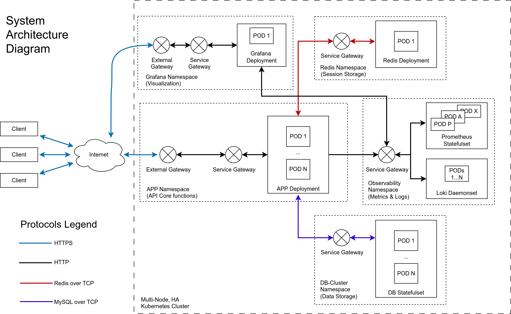
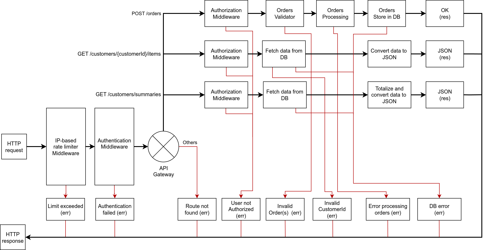

# Simple order manager for e-commerce
By José David González

## System Architecture
Following Martin Fowler advice, the architecture should start with a simple Monolith implementation. The current state of system orchestration solutions and development collaboration tools allow deploying scalable solutions without incurring in early over-optimizations. 

For this particular project, I’d pick a Kubernetes cluster for production deployment, because it will make a the service scalable and easy to manage. 



In the diagram, the external gateways represent the load balancer and ingress controller. The ingress controller (nginx) is also responsible for terminating the SSL (HTTPS) traffic to the clients. The  intra-cluster traffic can be unencrypted, but, if needed, a lighter encryption can be implemented.
The session data can be stored externally in an “in-memory” database like REDIS. Since the session details are centralized, one can create policies to scale up or down the amount of PODs running the workload, and use the Kubernetes Service gateway controller as load balancer. This also provides High-Availablity in multi node cluster using proper node-affinity policies. 

Given that this order data is highly structured, a relational database with powerful indexing capabilities would be ideal. My vote would go to Percona MySQL Cluster, that is reliable and easy to deploy and maintain in a Kubernetes environment. 
Additionally, an observability (Prometheus, Loki, Alertmanager) and visibility (Grafana) layers can be added to centralize the monitor of the platform.

## HTTP request flow



Now drilling down into the main service, an IP-based rate limiter should be implemented. This requires detailed configuration for the ingress controller and service controller to avoid masking the real client IP. 

Next an authentication Middleware will validate user credentials. It can be via a user/password and JWT or API Keys in the header of the request.
Once the user is authenticated, the API gateway will redirect the request to its corresponding endpoint.

The endpoints are:

| Endpoint                        | Method | Description                           |
| ------------------------------- | ------ | ------------------------------------- |
| `/orders`                       | POST   | Submit one or more orders             |
| `/customers/{customerId}/items` | GET    | Fetch all items purchased by customer |
| `/customers/summaries`          | GET    | Get purchase summaries for all        |


All endpoints have an authorization middleware to ensure that the user is allowed to access it.

The **/orders** endpoint, receives a POST with order(s) data, and has a validator to confirm that all the required keys are included. It has a simple order processing logic and a DB write function for the corresponding tables. This endpoint returns an OK message, and provides error messages if there is a problem with the order validation, processing and storage.

Through the **/customers/{customerId}/items** endpoint, the user fetches customer data from the DB. It provides error messages if the customerId is not found.

The **/customers/summaries** is used to fetch all clients data from the DB. It calculates the aggregated data for the final report. However, this calculation can also be implemented in the DB engine itself via virtual fields.

The last 2 endpoints contain a function to convert the data into the required JSON format.

## Assumptions for the Batch Transform Endpoint

- Since the list of all items purchased by an individual customer does not contains the related orderId per item, the returning the list of customer items in the batch processor only has unique items. If an item was ordered in several orders by the same client, it will show only once. 
- This also assumes that the item price is the same for all the orders.
- No authentication nor authorization are implemented.
- The server is working in plain HTTP. This code is not meant to be production ready.

## Other remarks about the Batch Transform Endpoint

The current return JSON omits a top-level customerId on each list of items to enforce strict adherence to the format used when returning the list of customer items. But it would be better to have a top-level customerId for each customer's list of items. This will reduce the response payload and enable faster filtering..

```
[
  {
    "customerId": "01",
    "items": [
      {
        "itemId": "20201",
        "costEur": 12.5
      },
      {
        "itemId": "20202",
        "costEur": 7.9
      },
    ]
  },
  {
    "customerId": "02",
    "items": [
      {
        "itemId": "20203",
        "costEur": 5.2
      },
    ]
  }
]
```


## Additional information

- [Quick installation and run guide](install.md)
- [Code coverage report](https://htmlpreview.github.io/?https://github.com/josedgm/orders_go/blob/main/coverage.html#file1)
